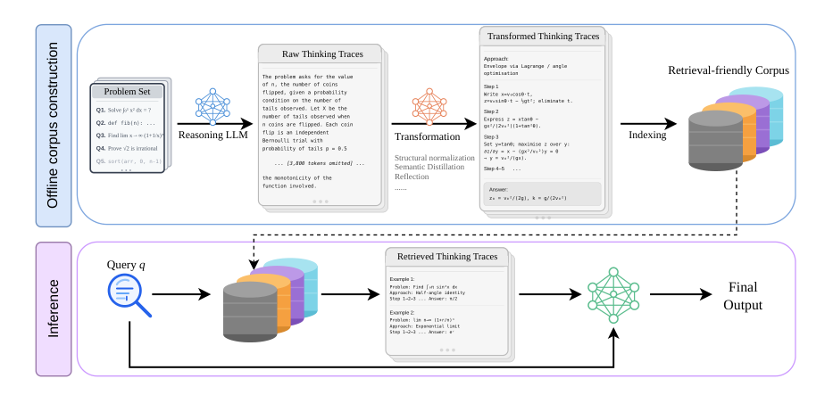

# T3: Transformation of Thinking Traces

<p align="center">
  <a href="https://huggingface.co/narabzad"></a>
  &nbsp;
  <a href="#"></a>
</p>

RAG is widely believed to offer limited benefit for reasoning-intensive tasks like math and code. We challenge this assumption: **the limitation is the corpus, not the approach**. We show that retrieving *thinking traces* — intermediate reasoning trajectories from strong models — consistently improves performance across frontier models and benchmarks. We further introduce **T3**, an offline method that transforms raw traces into structured, retrieval-friendly representations, unlocking even stronger gains.

> **Key results on AIME 2025–2026:** RAG with Gemini-2-thinking traces improves Gemini-2.5-Flash by +50.1%, GPT-OSS-120B by +8.6%, and GPT-5 by +5.8%. T3 transformations also reduce inference cost by up to 15%.



## How It Works

**Offline:** A strong reasoning model (e.g., Gemini-2-thinking, QwQ-32B) solves an auxiliary problem set and produces raw thinking traces. A smaller model (e.g., Gemini-2-Flash-Lite) then rewrites them into structured retrieval-friendly forms using T3.

**At inference time:** A previously unseen query is retrieved against this corpus; the top-*k* passages (e.g., k=3) are returned and used as context to perform RAG, enabling a downstream solver model to generate the final answer — no training or fine-tuning required.

### T3 Transformations

| File prefix | Paper name | Description |
|-------------|------------|-------------|
| `t3_struct` | Structural Normalization | Rewrites traces into clean step-by-step procedural scaffolds; one trace can produce multiple passages |
| `t3_reflect` | Reflection | Contrastive form highlighting common mistakes, misleading paths, and how to avoid them |
| `t3_semantic` | Semantic Distillation | Multi-level abstraction; compresses traces to their core reasoning idea |

## Repository Structure

```
t3/
├── data/
│   ├── queries/                      # Benchmark question sets
│   │   ├── aime_2025_2026_queries.jsonl
│   │   ├── gpqa_queries.jsonl
│   │   └── lcb_v4_minus_v2_queries.jsonl
│   └── traces/
│       ├── raw/                      # Raw thinking traces (114K OpenThoughts + 59K s1k)
│       │                             # → HuggingFace: narabzad/t3-traces-*
│       └── transformed/              # T3-transformed corpora
│                                     # → HuggingFace: narabzad/t3-struct-*, t3-reflect-*, t3-semantic-*
├── eval/
│   ├── tasks/                        # lm-evaluation-harness task configs
│   │   ├── aime/
│   │   ├── gpqa/
│   │   └── lcb/
│   └── scripts/
│       └── run_single_eval.sh        # Eval runner (all models via OpenRouter)
└── data_transform/
    ├── README.md                     # How to apply T3 transformations
    ├── run_all_prompts_gpt.py        # Runs all three T3 transformations
    └── prompts/                      # Prompt templates for each transformation
```

## Benchmarks

| Benchmark | Description | Problems | Eval setting |
|-----------|-------------|----------|--------------|
| AIME 2025–2026 | AMC/AIME math competitions | 60 total | 8 samples/question (agg@8) |
| GPQA Diamond | Graduate-level science questions | 198 | 4 samples/question (agg@4) |
| LiveCodeBench v4 | Competitive programming (2024-04 → 2024-09) | 202 | 4 samples/question (agg@4) |

## HuggingFace Datasets

All datasets are published on [HuggingFace](https://huggingface.co/narabzad).

### Raw Thinking Traces

| Dataset | Model | Traces | Columns |
|---------|-------|--------|---------|
| [t3-traces-gemini2thinking](https://huggingface.co/datasets/narabzad/t3-traces-gemini2thinking) | Gemini-2-thinking | 58K | `question`, `trace` |
| [t3-traces-gptoss120b](https://huggingface.co/datasets/narabzad/t3-traces-gptoss120b) | GPT-OSS-120B | 57K | `question`, `trace` |
| [t3-traces-qwq32b](https://huggingface.co/datasets/narabzad/t3-traces-qwq32b) | QwQ-32B | 57K | `question`, `trace` |

### T3-Transformed Corpora

| Dataset | Transformation | Source | Passages | Columns |
|---------|---------------|--------|----------|---------|
| [t3-struct-gemini2thinking](https://huggingface.co/datasets/narabzad/t3-struct-gemini2thinking) | Structural Normalization | Gemini-2-thinking 58K | 78K | `question`, `trace`, `transformed_traces` |
| [t3-reflect-gemini2thinking](https://huggingface.co/datasets/narabzad/t3-reflect-gemini2thinking) | Reflection | Gemini-2-thinking 58K | 58K | `question`, `trace`, `transformed_traces` |
| [t3-semantic-gemini2thinking](https://huggingface.co/datasets/narabzad/t3-semantic-gemini2thinking) | Semantic Distillation | Gemini-2-thinking 58K | 58K | `question`, `trace`, `transformed_traces` |
| [t3-struct-qwq32b](https://huggingface.co/datasets/narabzad/t3-struct-qwq32b) | Structural Normalization | OpenThoughts QwQ-32B 114K | 155K | `question`, `trace`, `transformed_traces` |
| [t3-reflect-qwq32b](https://huggingface.co/datasets/narabzad/t3-reflect-qwq32b) | Reflection | OpenThoughts QwQ-32B 114K | 114K | `question`, `trace`, `transformed_traces` |
| [t3-semantic-qwq32b](https://huggingface.co/datasets/narabzad/t3-semantic-qwq32b) | Semantic Distillation | OpenThoughts QwQ-32B 114K | 114K | `question`, `trace`, `transformed_traces` |

```python
from datasets import load_dataset

# Raw thinking traces
ds = load_dataset("narabzad/t3-traces-gemini2thinking")
# Columns: question, trace

# T3-transformed passages
ds = load_dataset("narabzad/t3-struct-gemini2thinking")
# Columns: question, trace, transformed_traces (list)
```

## Retrieved Results

Pre-computed top-3 retrieved passages for each benchmark question are in `data/retrieved_results/`.

| File prefix | Corpus |
|-------------|--------|
| `t3_struct_e5base_full` | T3 Structural Normalization, e5-base, full-doc |
| `t3_reflect_e5base_full` | T3 Reflection, e5-base, full-doc |
| `t3_semantic_e5base_full` | T3 Semantic Distillation, e5-base, full-doc |
| `trajectories_gemini2thinking_e5base_512` | Raw Gemini-2-thinking traces, e5-base, chunk=512 |
| `trajectories_qwq32b_e5base_{512,full}` | Raw QwQ-32B thinking traces, e5-base |
| `trajectories_gptoss120b_e5base_{512,full}` | Raw GPT-OSS-120B thinking traces, e5-base |

All retrieval uses **top-3** passages.

## Models Evaluated

| Model | Provider |
|-------|----------|
| GPT-5 (2025-08-07) | OpenAI |
| Gemini 2.5 Flash | Google |
| GPT-OSS-120B (DeepInfra BF16) | OpenRouter |

## RAG Pipeline & Evaluation

### Prerequisites

```bash
# Install lm-evaluation-harness
pip install lm-eval

# Set API key (all evals run via OpenRouter)
export OPENROUTER_API_KEY=your_key_here
```

### Option A — Use pre-computed retrieved results

Pre-computed top-3 passages are in `data/retrieved_results/`. Pick a benchmark, a corpus, and run:

```bash
# AIME with T3-Structural Normalization corpus
bash eval/scripts/run_eval.sh \
    --model qwen/qwq-32b \
    --bench aime \
    --retrieval data/retrieved_results/aime_2025_2026/t3_struct_e5base_full.jsonl

# GPQA with raw Gemini-2-thinking traces
bash eval/scripts/run_eval.sh \
    --model openai/gpt-4o \
    --bench gpqa \
    --retrieval data/retrieved_results/gpqa/trajectories_gemini2thinking_e5base_512.jsonl

# LiveCodeBench with T3-Reflection corpus
bash eval/scripts/run_eval.sh \
    --model google/gemini-2.5-flash \
    --bench lcb \
    --retrieval data/retrieved_results/lcb_v4/t3_reflect_e5base_full.jsonl

# No-RAG baseline
bash eval/scripts/run_eval.sh \
    --model qwen/qwq-32b \
    --bench aime \
    --no-rag
```

`--bench` loads the corresponding task YAML from `eval/tasks/{aime,gpqa,lcb}/` automatically.
`--model` accepts any [OpenRouter model ID](https://openrouter.ai/models).
Results are saved under `results/{bench}/{model}/{label}/`.

### Option B — Build your own retriever from HuggingFace

```python
from datasets import load_dataset
from sentence_transformers import SentenceTransformer
import faiss
import numpy as np

# Load any T3 corpus from HuggingFace
corpus = load_dataset("narabzad/t3-struct-gemini2thinking", split="train")
docs   = [p for row in corpus for p in row["transformed_traces"]]

# Build FAISS index with e5-base
encoder = SentenceTransformer("intfloat/e5-base-v2")
vecs    = encoder.encode([f"passage: {d}" for d in docs], batch_size=256, show_progress_bar=True)
faiss.normalize_L2(vecs)
index   = faiss.IndexFlatIP(vecs.shape[1])
index.add(vecs)

def retrieve(query: str, top_k: int = 3) -> list[str]:
    q_vec = encoder.encode([f"query: {query}"])
    faiss.normalize_L2(q_vec)
    _, ids = index.search(q_vec, top_k)
    return [docs[i] for i in ids[0]]
```

Then generate with any model via OpenRouter:

```python
from openai import OpenAI

client = OpenAI(
    base_url="https://openrouter.ai/api/v1",
    api_key=os.environ["OPENROUTER_API_KEY"],
)

def rag(question: str, model: str = "qwen/qwq-32b") -> str:
    examples = retrieve(question)
    prompt = (
        "Use the following examples to help solve the problem.\n\n"
        + "\n\n".join(f"Example {i+1}: {ex}" for i, ex in enumerate(examples))
        + f"\n\nMain problem: {question}"
    )
    resp = client.chat.completions.create(
        model=model,
        messages=[{"role": "user", "content": prompt}],
    )
    return resp.choices[0].message.content
```

## Data Format

**Query files** (`.jsonl`): each line has `id`, `problem`, `answer`, `query`.

**Retrieved results files** (`.jsonl`): same fields plus `ctxs` — a list of top-3 passages, each with `id`, `title`, `text`, `score`.

## T3 Transformation Code

See [`data_transform/README.md`](data_transform/README.md) for how to apply T3 transformations to your own thinking traces.

```bash
python data_transform/run_all_prompts_gpt.py \
    --input  your_thinking_traces.jsonl \
    --outdir outputs/ \
    --prompts t3_struct t3_reflect t3_semantic \
    --model  gpt-4o-mini \
    --concurrency 50
```
